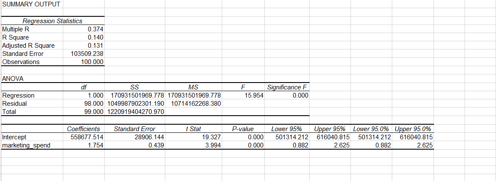
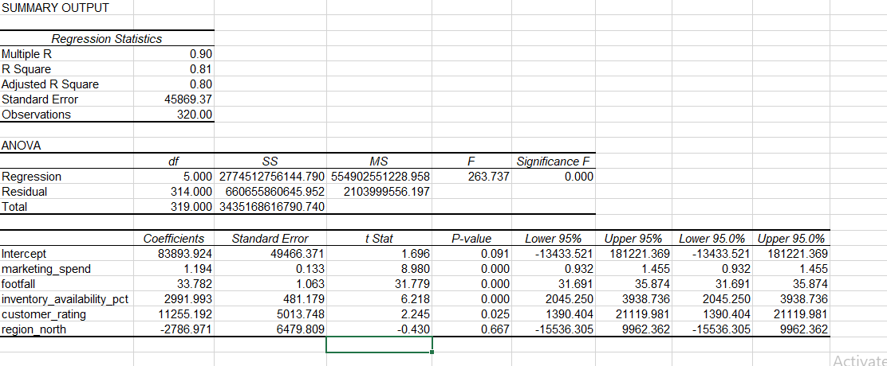
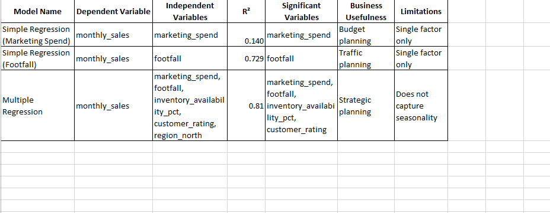
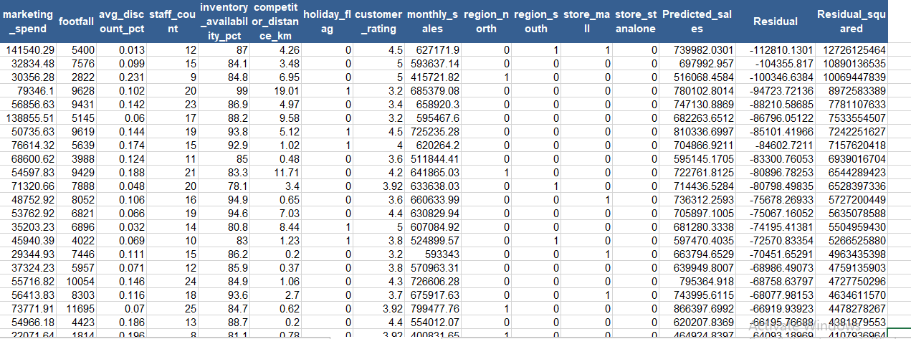

# Task 1: Dataset Understanding

## Dependent Variable
- monthly_sales

## Potential Independent Variables
- marketing_spend
- footfall
- avg_discount_pct
- staff_count
- inventory_availability_pct
- competitor_distance_km
- holiday_flag
- customer_rating
- region
- store_type

## Numerical Variables
- marketing_spend
- footfall
- avg_discount_pct
- staff_count
- inventory_availability_pct
- competitor_distance_km
- customer_rating
- monthly_sales
- monthly_profit

## Categorical Variables
- region
- store_type
- holiday_flag

## Variables Needing Cleaning/Transformation
- Missing values in competitor_distance_km
- Missing values in customer_rating
- Encode region and store_type
- Transform month into useful time features
- Check for outliers in monthly_sales, marketing_spend, and footfall

## Variables Not Useful for Regression
- store_id
- monthly_profit (to avoid leakage if predicting sales)

# Retail Sales Regression Analysis Project

## Business Problem Summary

The leadership team of a retail chain wants to understand which factors drive monthly sales performance across stores.

The business is considering actions such as increasing marketing spend, improving inventory availability, adjusting discount strategies, reallocating staff, and prioritizing certain store types or regions.

The objective of this project is to use regression analysis to identify the variables most strongly associated with monthly sales and provide data-driven business recommendations.

---

## Dataset Description

The dataset contains store-level business performance data with 320 observations.

It includes variables related to marketing, customer traffic, discounts, staffing, stock availability, customer satisfaction, store region, and store type.

The dataset was prepared and cleaned before analysis.

---

## Dependent and Independent Variables

### Dependent Variable

* monthly_sales

This is the target variable being predicted.

---

### Independent Variables

Numerical Variables:

* marketing_spend
* footfall
* avg_discount_pct
* staff_count
* inventory_availability_pct
* competitor_distance_km
* holiday_flag
* customer_rating

Categorical Variables:

* region
* store_type

---

## Regression Approach

The project used both simple and multiple regression models.

### Simple Regression

Two simple regression models were created:

1. monthly_sales vs marketing_spend
2. monthly_sales vs footfall

These models were used to understand the individual impact of each variable.

---

### Multiple Regression

A multiple regression model was created using:

* marketing_spend
* footfall
* inventory_availability_pct
* customer_rating
* region_north (dummy)

This model was selected as the final model.

The final model achieved:

* R-squared = 0.81
* Adjusted R-squared = 0.80

This means it explains 81% of the variation in monthly sales.

---

## Dummy Variable Approach

Categorical variables cannot be directly used in regression.

The region variable was converted into dummy variables:

* region_north
* region_south

Reference category used:

* West

This means all regional comparisons were made against West.

Dummy variables were created carefully to avoid redundancy and multicollinearity.

---

## Model Comparison Summary

### Model 1: Marketing Spend

* R-squared = 0.140
* Weak explanatory power
* Significant predictor

---

### Model 2: Footfall

* R-squared = 0.7291
* Strong explanatory power
* Significant predictor

---

### Model 3: Multiple Regression

* R-squared = 0.81
* Strongest explanatory power
* Most comprehensive model

The multiple regression model outperformed the simple models.

---

## Final Model Selected

Final selected model:

* Multiple Regression Model

Reason for selection:

It had the highest explanatory power and included multiple important business variables.

It provides better decision-making support than single-variable models.

---

## Business Recommendation

The strongest factors associated with monthly sales are:

* footfall
* inventory availability
* marketing spend
* customer rating

Leadership should focus on:

* increasing customer traffic
* improving stock availability
* improving customer experience
* optimizing marketing investments

The region variable was weak and should not be over-interpreted.

---

## Assumptions and Limitations

This analysis assumes:

* linear relationships between variables
* stable business conditions
* no major hidden variables

Limitations:

* seasonality was not included
* competitor actions were not fully captured
* local economic conditions may affect performance
* regression shows association, not causation

The model should be used as a decision-support tool rather than an absolute predictor.

---

## Screenshots Included

The project includes the following screenshots:

* simple_regression_output.png
* multiple_regression_output.png
* model_comparison_preview.png
* residuals_preview.png

Example:

## Simple Regression

## Multiple Regression

## Model Comparison Preview

## Residual Preview 

